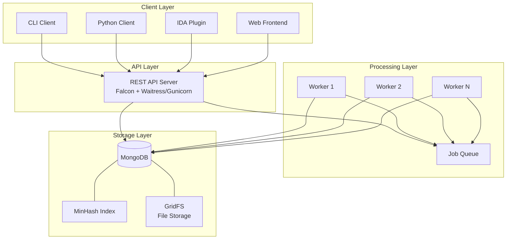
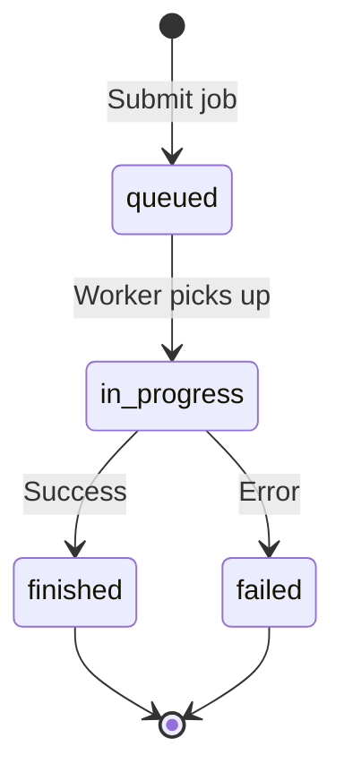

# System architecture

MCRIT follows a distributed client-server architecture designed for scalability and efficient processing of code similarity analysis at scale.

## Component overview



## Core components

### REST API server

The server component provides the primary interface to MCRIT functionality.

**Implementation**: `mcrit/server/application_routes.py`

<Tabs>
  <Tab title="Key features">
    - Falcon-based REST API with route-based resource handling
    - Authentication via API tokens (optional)
    - Support for both Waitress (default) and Gunicorn (Linux) WSGI servers
    - Request validation and error handling
    - Job scheduling and queue management
  </Tab>
  <Tab title="Main endpoints">
    - `/status` - Server and database statistics
    - `/samples` - Sample submission and management
    - `/functions` - Function-level queries
    - `/matches` - Similarity matching operations
    - `/query` - Query endpoints for binaries and hashes
    - `/jobs` - Job status and result retrieval
    - `/families` - Malware family management
  </Tab>
  <Tab title="Configuration">
    The server can be configured via `McritConfig` settings:
    
    - `AUTH_TOKEN` - Optional API authentication token
    - Server listens on `*:8000` by default
    - Profiling support via `--profile` flag
    - Gunicorn deployment via `--gunicorn` flag (Linux only)
  </Tab>
</Tabs>

**Starting the server:**

```bash
# Default deployment with Waitress
mcrit server

# Linux deployment with Gunicorn (better performance)
mcrit server --gunicorn

# Enable profiling for performance analysis
mcrit server --profile
```

### Worker pool

Workers process computationally intensive jobs from the queue asynchronously.

**Implementation**: `mcrit/Worker.py`

<CardGroup cols={2}>
  <Card title="Standard Worker" icon="gears">
    Processes jobs sequentially in a single process. Suitable for most deployments.
    
    ```bash
    mcrit worker
    ```
  </Card>
  <Card title="Spawning Worker" icon="rocket">
    Spawns child processes for job execution to reduce memory lock issues.
    
    ```bash
    mcrit spawningworker
    ```
  </Card>
</CardGroup>

#### Worker capabilities

Workers handle the following operations:

<Steps>
  <Step title="Sample ingestion">
    - Binary disassembly via SMDA integration
    - Function extraction and storage
    - Sample metadata processing
  </Step>
  <Step title="Hash calculation">
    - MinHash generation using configurable shinglers
    - PicHash calculation for position-independent code
    - PicBlockHash for basic block matching
    - Band index updates
  </Step>
  <Step title="Similarity matching">
    - Sample-to-database matching
    - Sample-to-sample comparison
    - Function-level matching
    - Cross-comparison jobs
  </Step>
  <Step title="Maintenance operations">
    - Index rebuilding
    - Hash recalculation
    - Database cleanup
    - Unique block identification
  </Step>
</Steps>

**Worker architecture:**

```python
class Worker(QueueRemoteCallee):
    def __init__(self, queue, config, storage):
        self._worker_id = f"Worker-{uuid.uuid4()}"
        self.minhasher = MinHasher(config)
        self._storage = StorageFactory.getStorage(config)
```

- Each worker has a unique ID for tracking
- Workers register/unregister with the queue
- Automatic cleanup on exit
- Progress reporting for long-running jobs

### MinHash index

The index provides efficient similarity search capabilities.

**Implementation**: `mcrit/index/MinHashIndex.py`

#### Indexing strategy

MCRIT uses Locality-Sensitive Hashing (LSH) via MinHash banding:

1. **MinHash signatures**: Each function is represented by a 64-element MinHash signature (configurable)
2. **Band decomposition**: Signatures are split into bands (default: 20 bands of 4 elements)
3. **Band indexing**: Functions with matching bands become candidates for similarity comparison
4. **Threshold matching**: Candidate pairs are compared; matches above threshold are retained

<Note>
The banding strategy balances recall (finding similar functions) vs. precision (avoiding false positives). More bands increase recall but may increase false positives.
</Note>

**Configuration options:**

```python
# MinHashConfig settings
MINHASH_SIGNATURE_LENGTH = 64      # Signature size
MINHASH_SIGNATURE_BITS = 8         # Bits per element
MINHASH_MATCHING_THRESHOLD = 50    # Match threshold (0-100)
BAND_MATCHES_REQUIRED = 2          # Minimum band matches

# StorageConfig banding
STORAGE_BANDS = {4: 20}            # 20 bands of size 4
STORAGE_BAND_STRATEGY = "random"   # or "linear"
```

#### Shingler system

Shinglers extract features from disassembled functions for hashing.

**Implementation**: `mcrit/shinglers/`

<Tabs>
  <Tab title="EscapedBlockShingler">
    Extracts sequences of instruction mnemonics from basic blocks, with operand escaping to abstract away constants and addresses.
    
    Weight: 3 (default)
  </Tab>
  <Tab title="FuzzyStatPairShingler">
    Generates statistical features based on instruction pairs and control flow patterns.
    
    Weight: 1 (default)
  </Tab>
</Tabs>

**Shingler configuration:**

```python
SHINGLERS_WEIGHTS = {
    "FuzzyStatPairShingler": 1,
    "EscapedBlockShingler": 3
}
SHINGLER_LOGBUCKETS = 100000
SHINGLER_LOGBUCKET_RANGE = 1
```

### Storage layer

MCRIT uses MongoDB for persistent storage with specialized collections.

**Implementation**: `mcrit/storage/MongoDbStorage.py`

#### Database schema

<CardGroup cols={2}>
  <Card title="Collections" icon="database">
    - `families` - Malware family metadata
    - `samples` - Binary sample information
    - `functions` - Disassembled function data
    - `function_labels` - User-provided function names
    - `minhashes` - MinHash signatures
    - `pichashes` - Position-independent code hashes
    - `picblockhashes` - Basic block hashes
    - `bands` - MinHash band index
    - `jobs` - Queue job tracking
    - `results` - Job results (GridFS)
  </Card>
  <Card title="Key indexes" icon="magnifying-glass">
    - Sample SHA256 hash
    - Function ID lookups
    - Band hash lookups (critical for performance)
    - Family ID references
    - Job state and timestamp
  </Card>
</CardGroup>

#### Data model

```python
class SampleEntry:
    sample_id: int              # Unique identifier
    sha256: str                 # Binary hash
    family: str                 # Malware family name
    architecture: str           # CPU architecture
    base_addr: int              # Load address
    binary_size: int            # Size in bytes
    statistics: dict            # Function counts, etc.
    timestamp: datetime         # Submission time
```

```python
class FunctionEntry:
    function_id: int            # Unique identifier
    sample_id: int              # Parent sample
    offset: int                 # Function offset
    num_instructions: int       # Instruction count
    num_blocks: int             # Basic block count
    pichash: str                # Position-independent hash
    xcfg: dict                  # Control flow graph (optional)
```

<Warning>
By default, XCFG (extended control flow graph) data is retained in the database. For large deployments, set `STORAGE_DROP_DISASSEMBLY = True` to save space after MinHash calculation.
</Warning>

### Job queue system

Asynchronous job processing enables scalable workload distribution.

**Implementation**: `mcrit/queue/LocalQueue.py`

#### Job lifecycle



#### Job types

| Job Type | Description | Priority |
|----------|-------------|----------|
| `addBinarySample` | Disassemble and index binary | Normal |
| `updateMinHashes` | Calculate missing hashes | Normal |
| `getMatchesForSample` | Sample similarity matching | High |
| `getMatchesForSmdaReport` | Query matching | High |
| `getUniqueBlocks` | Unique code block identification | Normal |
| `rebuildIndex` | Rebuild MinHash band index | Low |
| `doDbCleanup` | Clean up query samples | Low |

**Job management:**

```python
# Submit a job
job_id = index.addBinarySample(
    binary_data, 
    filename="sample.exe",
    family="emotet"
)

# Check job status
job = index.getJobInfo(job_id)
print(f"State: {job['state']}")  # queued, in_progress, finished, failed

# Get job result
if job['state'] == 'finished':
    result = index.getResultForJob(job_id)
```

## Scalability considerations

### Horizontal scaling

- **Multiple workers**: Run multiple worker processes across machines
- **MongoDB replication**: Use replica sets for high availability
- **Load balancing**: Deploy multiple server instances behind a load balancer

### Performance optimization

<Tabs>
  <Tab title="MinHash calculation">
    ```python
    # Enable multiprocessing for hash calculation
    MINHASH_POOL_INDEXING = True
    MINHASH_POOL_MATCHING = True
    
    # Adjust batch sizes
    MINHASH_GENERATION_WORKPACK_SIZE = 10000
    MINHASH_MATCHING_FUNCTION_BATCH_SIZE = 10000
    ```
  </Tab>
  <Tab title="Storage optimization">
    ```python
    # Drop disassembly after indexing
    STORAGE_DROP_DISASSEMBLY = True
    
    # Enable in-memory band cache (requires RAM)
    STORAGE_CACHE = True
    
    # Adjust banding strategy
    STORAGE_BAND_STRATEGY = "linear"  # More deterministic
    ```
  </Tab>
  <Tab title="Server tuning">
    ```bash
    # Use Gunicorn on Linux for better concurrency
    mcrit server --gunicorn
    
    # Gunicorn workers (in GunicornConfig)
    workers = cpu_count() * 2 + 1
    worker_class = "sync"
    ```
  </Tab>
</Tabs>

### Memory management

<Warning>
Large-scale deployments processing millions of functions require careful memory management:

- Monitor worker memory usage
- Use SpawningWorker for memory-intensive operations
- Implement batch processing for bulk operations
- Consider enabling `STORAGE_DROP_DISASSEMBLY`
</Warning>

## Integration points

### SMDA integration

MCRIT relies on SMDA for binary disassembly:

```python
from smda.Disassembler import Disassembler
from smda.SmdaConfig import SmdaConfig

config = SmdaConfig()
disassembler = Disassembler(config)

# Disassemble unmapped binary
report = disassembler.disassembleUnmappedBuffer(binary_data)

# Disassemble memory dump
report = disassembler.disassembleBuffer(
    binary_data, 
    base_addr=0x400000,
    bitness=64
)
```

### Client integration

Multiple client interfaces support different use cases:

- **Python client**: Programmatic API access
- **CLI**: Command-line operations and scripting
- **IDA plugin**: Interactive analysis in IDA Pro
- **Web frontend**: Visual exploration (docker-mcrit)

## Configuration management

All components use a unified configuration system.

**Configuration hierarchy:**

```python
class McritConfig:
    STORAGE_CONFIG: StorageConfig
    MINHASH_CONFIG: MinHashConfig
    SHINGLER_CONFIG: ShinglerConfig
    QUEUE_CONFIG: QueueConfig
    AUTH_TOKEN: str = None
```

**Loading configuration:**

```python
from mcrit.config.McritConfig import McritConfig

# Default configuration
config = McritConfig()

# Custom configuration
config = McritConfig()
config.MINHASH_CONFIG.MINHASH_MATCHING_THRESHOLD = 70
config.STORAGE_CONFIG.STORAGE_DROP_DISASSEMBLY = True
```

<Info>
Configuration changes to MinHash parameters, shingler weights, or banding strategy require recalculation of all hashes and index rebuilding.
</Info>
