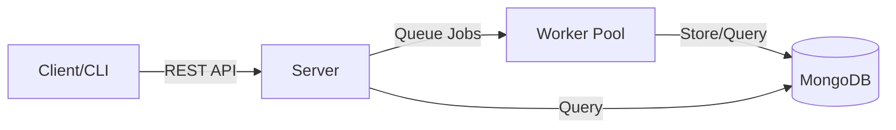

# MinHash-based Code Relationship & Investigation Toolkit

MCRIT is a framework created to simplify the application of the MinHash algorithm in the context of code similarity. It enables rapid implementation of "shinglers" - methods which encode properties of disassembled functions - to be used for similarity estimation via the MinHash algorithm.

<Note>
MCRIT is tailored to work with disassembly reports emitted by [SMDA](https://github.com/danielplohmann/smda) (Smart Disassembler Architecture).
</Note>

## Quick start

<CardGroup cols={2}>
  <Card title="Installation" icon="download" href="/getting-started/installation">
    Get started with Docker or standalone installation
  </Card>
  <Card title="Architecture" icon="diagram-project" href="/architecture">
    Understand the core components and design
  </Card>
  <Card title="Features" icon="sparkles" href="/features">
    Explore similarity matching and analysis capabilities
  </Card>
  <Card title="API reference" icon="code" href="/api/overview">
    Integrate MCRIT into your workflows
  </Card>
</CardGroup>

## Key capabilities

<Steps>
  <Step title="Code similarity detection">
    Compare binary samples and functions using MinHash-based fuzzy matching to identify similar code patterns across different compilations, versions, or malware families.
  </Step>
  <Step title="Large-scale indexing">
    Build persistent databases of hundreds of thousands of functions with MongoDB backend, enabling rapid similarity queries against massive reference datasets.
  </Step>
  <Step title="Flexible deployment">
    Deploy as a standalone service, distributed worker system, or integrate via Python client and REST API for automation.
  </Step>
  <Step title="Advanced analysis">
    Leverage PicHash matching, unique block identification, YARA rule generation, and function-level relationship tracking.
  </Step>
</Steps>

## Use cases

### Malware analysis and attribution

Identify code reuse across malware families, track malware evolution, and attribute samples to known threat actors by comparing against reference databases.

### Library and compiler detection

Detect common libraries and compiler artifacts in binary samples. MCRIT's reference data repository includes ready-to-use datasets for popular compilers and libraries.

<Info>
Check out the [MCRIT reference data repository](https://github.com/danielplohmann/mcrit-data) for pre-built compiler and library databases.
</Info>

### Code provenance and theft detection

Identify unauthorized code reuse, track intellectual property, and investigate potential code theft by comparing proprietary binaries against target samples.

### Vulnerability research

Locate functions similar to known vulnerable code patterns across different binaries and versions to identify potential security issues.

## Architecture overview

MCRIT follows a distributed architecture with three main components:



- **Server**: REST API endpoint handling requests and job management
- **Worker**: Background processors executing matching and analysis jobs
- **Storage**: MongoDB database for persistent data and MinHash indices
- **Client**: Python library and CLI for interaction

## Getting started

<Tip>
We highly recommend using the fully packaged [docker-mcrit](https://github.com/danielplohmann/docker-mcrit) for trivial deployment. This ensures compatible versions across all components.
</Tip>

### Dockerized deployment

The Docker deployment includes:
- MCRIT server and workers
- MongoDB for persistence
- Web frontend for convenient interaction
- Compatible component versions

See the [Installation](/getting-started/installation) guide for detailed setup instructions.

### Standalone installation

For standalone deployment on Ubuntu:

```bash
# Install Python dependencies
sudo apt install python3 python3-pip
pip install -r requirements.txt

# Install MongoDB 5.0
sudo apt-get install gnupg
wget -qO - https://www.mongodb.org/static/pgp/server-5.0.asc | sudo apt-key add -
echo "deb [ arch=amd64,arm64 ] https://repo.mongodb.org/apt/ubuntu jammy/mongodb-org/5.0 multiverse" | sudo tee /etc/apt/sources.list.d/mongodb-org-5.0.list
sudo apt-get update
sudo apt-get install -y mongodb-org

# Start MongoDB service
sudo systemctl start mongod
sudo systemctl enable mongod

# Install MCRIT
pip install -e .
```

### Running the service

Start the server and worker components:

```bash
# Terminal 1: Start the REST API server
mcrit server

# Terminal 2: Start a worker
mcrit worker
```

The REST API server will be listening on `http://127.0.0.1:8000/` by default.

## Basic usage examples

### Using the CLI

```bash
# Check server status and database statistics
mcrit client status

# Submit a binary sample for analysis
mcrit client submit sample_unpacked -f malware_family_name

# Query matches for a sample
mcrit client query sample_id
```

### Using the Python client

```python
from mcrit.client.McritClient import McritClient

# Connect to MCRIT server
client = McritClient()

# Get server status
status = client.getStatus()
print(f"Samples: {status['num_samples']}")
print(f"Functions: {status['num_functions']}")

# Submit a binary for matching
with open('sample.bin', 'rb') as f:
    result = client.addBinarySample(f.read(), filename='sample.bin', family='test')
```

## Community and support

MCRIT is an open-source project licensed under GPLv3. Contributions are welcome!

- **GitHub**: [danielplohmann/mcrit](https://github.com/danielplohmann/mcrit)
- **Issues**: Report bugs and request features on GitHub
- **Reference Data**: [mcrit-data repository](https://github.com/danielplohmann/mcrit-data)

## Credits

MCRIT was created by Daniel Plohmann and Manuel Blatt, with contributions from Steffen Enders and Paul Hordiienko.

<Info>
MCRIT is developed and maintained by the Fraunhofer FKIE institute.
</Info>
